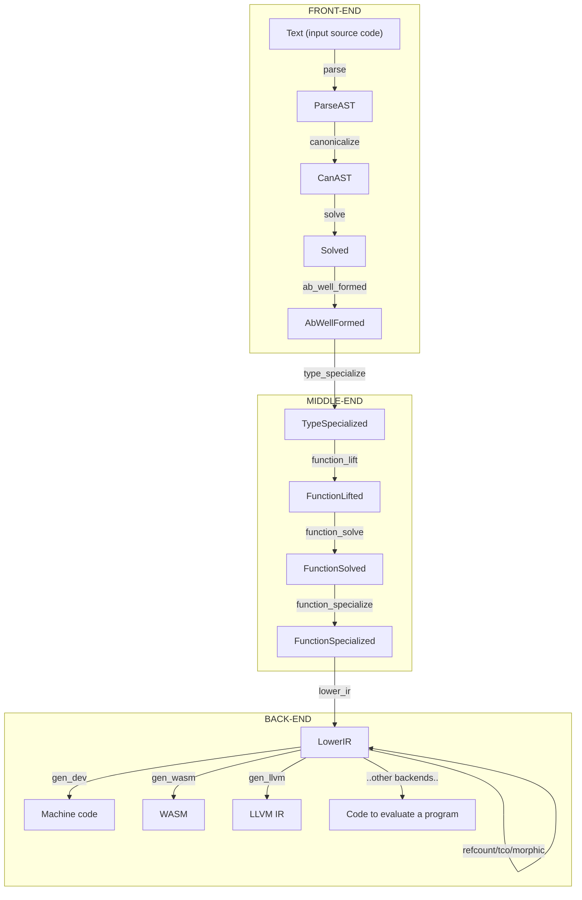

# Compiling lambda sets

Status: Review

## Overview

This document describes an approach to compiling lambda sets that will be
simpler and more reliable than the approach used today.

I'll start from the bottom and explain how to compile programs in general, then
provide extensions for abilities and explain how to support multiple
modules/caching in the future.

I'll also name "lambda sets" "function sets" since I think it will be an easier
name to manage.

## Quick view

Let's do a walkthrough of what we're trying to do. This overview will introduce
the language and high-level details of the procedure. In subsequent sections
I'll dive deeper on each of these steps.

The pipeline we will take is the following. Arrows indicate the name of the
procedure. The output of an arrow is the name of the intermediate
representation produced.



<details>
<summary>Detailed pipeline</summary>

```python
>> FRONT-END
   The user may have input an invalid program at this point.

# input source code
                         Text

# create a machine-traversable tree of tokens
# after this step, the program is syntactically valid
Text     -parse->        ParseAST

# normalize program, desugar, resolve links between names like x = 1; x + x
# after this step, all non-ability variable usages are defined
ParseAST -canonicalize-> CanAST       

# run type inference and type checking on the program
# after this step, the program is known to have no type errors
CanAST   -solve->        Solved

# check that all concrete variables used as abilities satisfy the ability
# after this step, there is no surface for user errors in the program
Solved   -ab_well_formed->   AbWellFormed

>> MIDDLE-END
   At this point, there can be no more errors that are due to an invalid program.
   All errors here are compiler bugs.

# replace all calls to generic functions and abilities with concrete instances
# after this step, the program has no generic types
AbWellFormed    -type_specialize->     TypeSpecialized

# lift all closures to the top-level and leave behind closure captures
# after this step, the program has no more implicit closures
TypeSpecialized -function_lift->       FunctionLifted

# infer all sets of functions passed to higher-order function (HOF) calls
# after this step, every call to a HOF is assigned a variable with the set of functions passed (function set) or a generalized variable
FunctionLifted  -function_solve->      FunctionSolved

# replace all calls to HOFs with concrete copies
# after this step, the program has no HOFs (the program is first-order)
FunctionSolved  -function_specialize-> FunctionSpecialized

>> BACK-END
   At this point, the program is equivalent to a subset of Roc with no HOFs and no generic types.

# convert the program to a single-step IR and concrete memory layouts
# after this step, the program is trivially reducible to ANF or SSA.
FunctionSpecialized -lower_ir-> LowerIR

# perform refcount-insertions and various optimizations
LowerIR -refcount-> LowerIR
LowerIR -tco->      LowerIR

# infer the program's borrow/ownership semantics and specialize calls to
# borrow-generic functions to instances of borrowing or owning calls
LowerIR -morphic->  LowerIR

# compile the program to one of a number of machine-codes or runtimes
LowerIR -gen_dev->  machine code
LowerIR -gen_wasm-> WASM
LowerIR -gen_llvm-> LLVM IR -llvm-> machine code
LowerIR -..other backends..-> ..
```

</details>

In this document, we will mostly just discuss the middle-end.

Suppose we have the source program

```roc
apply = \f, x -> f x

main =
  num = 1
  x1 = apply (\x -> x + num) 1
  x2 = apply (\s -> "${s}!") "hi"
  { x1, x2 }
```

where `main` is the entry-point of the program (exposed to the host, or an
expect).

### solve

Suppose we have already parsed this program and resolved symbols
(canonicalization). The next step is to infer the type of this program. I won't
go into all the details here, but the idea is to assign "type variables" to
variables and expressions that are solved via constraints (e.g. a string literal
forces the type variable to be assigned to `Str`). For simplicity, let's suppose
all number literals are `I64` for now.

Type inference must process the reduction of the dependency graph, i.e. a DAG.
In this case the DAG is `apply -> main` on the toplevel, and `x1 -> {x1, x2} <-
x2` inside `main`.

I'll use the prefix `g_`
denotes a type variable that can be instantiated with any type when used (it is
a generalized, or generic, type). The type of this program is

```roc
apply : (g_f_arg1 -> g_f_ret), g_f_arg1 -> g_f_ret
apply = \f, x -> f x

main : { x1: I64, x2: Str }
main =
  num : I64
  num = 1

  x1 : I64
  x1 = apply (\x -> x + num) 1   # apply here is : (I64 -> I64) -> I64
  
  x2 : Str
  x2 = apply (\s -> "${s}!") "hi"   # apply here is : (Str -> Str) -> Str

  { x1, x2 }   # : { x1: I64, x2: Str }
```

### ab_well_formed

Skipped for now

### type_specialize

The next thing we're going to do is get rid of all generalized types in this
program. This is necessary that calls to `apply` can operate on a concrete
instance of `apply` that what the memory layout of its arguments and return type
is. This produces more memory- and CPU-efficient code than operating over the
generic representations. A procedure of this kind is called "specialization" or
"monomorphization". In this document I'll call it "type specialization", because
there is another kind of specialization we'll see later.

To perform type specialization, we create copies of generalized values for each
concerete usage, and then fix-up the call sites to reference the copy. Doing
this over the program above, we end up with

```roc
apply_1 : (I64 -> I64), I64 -> I64
apply_1 = \f, x -> f x

apply_2 : (Str -> Str), Str -> Str
apply_2 = \f, x -> f x

main : { x1 : I64, x2: Str }
main =
  num : I64
  num = 1

  x1 : I64
  x1 = apply_1 (\x -> x + 1) 1
  
  x2 : Str
  x2 = apply_2 (\s -> "${s}!") "hi"

  { x1, x2 }
```

### function_lift

Next, we lift up all nested functions to the top-level. We'll want to allocate a
new variable for all values that the function captures, and pass those to the
function as well. We'll introduce a new operator, `@fnpack`, that packages a
capturing function into a tuple of `(function name, captures)`.

If a function captures, we pass its captures as a separate record in the first
parameter. When we need to hold on to a value of a capturing function, we pass
around the `@fnpack` tuple.

```roc
apply_1 : (I64 -> I64), I64 -> I64
apply_1 = \f, x -> f x

apply_2 : (Str -> Str), Str -> Str
apply_2 = \f, x -> f x

fn_1 : { num: I64 }, I64 -> I64
fn_1 = \captures, x ->
    num = captures.num
    x + num

fn_2 : Str -> Str
fn_2 = \s -> "${s}!"

main : { x1 : I64, x2: Str }
main =
  num : I64
  num = 1

  fn_1_pack = @fn_pack( fn_1, { num } )

  x1 : I64
  x1 = apply_1 fn_1_pack 1

  fn_2_pack = @fn_pack( fn_2 )
  
  x2 : Str
  x2 = apply_2 fn_2_pack "hi"

  { x1, x2 }
```

### function_solve

We're now ready to start what we need for lambda-set specialization, which I'll
call function specialization from now on.

The key idea here is to start thinking about functions as "generic" or "concrete" over the values of functions they take in.

For example, the higher-order function `mapListI64 : List I64, (I64 -> I64) -> List I64` is generic over functions `(I64 -> I64)` in the second parameter.

This is very similar to type specialization. Like specializing generic types to
concrete types, we want to specialize generic higher-order functions to concrete instances of functions they use.

This matters for the same reason type specialization matters.
While the memory layout of `List I64` is now known to be concrete, a function `(I64 -> I64)` has a variable memory layout depending on how many values it captures.
At minimum, the runtime must be given a function pointer.
If the function captures variables, those must be passed as well. Since
`(I64 -> I64)` tells us nothing about the size of the captures, in general the
captures must be placed somewhere in memory (typically allocated on the heap)
and a pointer to them must be passed. The general form for compiling functions
like this is to pass a tuple of `(function pointer, captures pointer)` for each
function argument.

It also matters for other optimization reasons which will be discussed later.

Our goal is to eliminate the need for indirecting the captures behind a pointer,
and we'll see that in many cases we can even do much better than that.

Okay, so first we annotate all function types as either generic (higher-order)
or consisting of a set of concrete functions.
Function types are given a variable, orthogonal to type variables, called "function set variables".
A function set variable is either generic, in which case it is prefixed with `G_`, or otherwise concrete, in which case it is annotated as a union of function values that can be in that position.
Each function value is accompanied with a record the values that it captures.
For example, a function type `I64 -[f {a: I64}, g {b: Str}]-> I64`
has the function set `[f {a: I64}, g {b: Str}, h]`,
indicating that the function is either `f` with a capture of `a: I64`,
`g` with a capture of `b: Str`, or `h` with no captures.

This is pretty much the same as type inference of tag unions. Solving for our
program, we get

```roc
apply_1 : (I64 -G_1-> I64), I64 -[apply_1]-> I64
apply_1 = \f, x -> f x

apply_2 : (Str -G_2-> Str), Str -[apply_2]-> Str
apply_2 = \f, x -> f x

fn_1 : { num: I64 }, I64 -[fn_1]-> I64
fn_1 = \captures, x ->
    num = captures.num
    x + num

fn_2 : Str -[fn_2]-> Str
fn_2 = \s -> "${s}!"

main : { x1 : I64, x2: Str }
main =
  num : I64
  num = 1

  fn_1_pack : FunctionSet[fn_1 {num: I64}]
  fn_1_pack = @fn_pack( fn_1, { num } )

  x1 : I64
  x1 = apply_1 fn_1_pack 1    # apply_1 has type (I64 -[fn_1 {num: I64}]-> I64) -[apply_1]-> I64

  fn_1_pack : FunctionSet[fn_2]
  fn_2_pack = @fn_pack( fn_2 )
  
  x2 : Str
  x2 = apply_2 fn_2_pack "hi"    # apply_2 has type (Str -[fn_2]-> Str) -[apply_2]-> Str

  { x1, x2 }
```

### function_specialize

To perform function specialization, we create copies of generic higher-order
functions (HOFs) for concerete usage, and then fix-up the call sites to reference the copy.
Moreover, we re-write each function set to be a tag union that we pass to the
function. Let's do this in two steps to understand how this works.

First, we replace all HOFs with specialized copies and update the usage sites

```roc
apply_1_1 : (I64 -[fn_1 {num: I64}]-> I64), I64 -[apply_1]-> I64
apply_1_1 = \f, x -> f x

apply_2_1 : (Str -[fn_2]-> Str), Str -[apply_2]-> Str
apply_2_1 = \f, x -> f x

fn_1 : { num: I64 }, I64 -[fn_1]-> I64
fn_1 = \captures, x ->
    num = captures.num
    x + num

fn_2 : Str -[fn_2]-> Str
fn_2 = \s -> "${s}!"

main : { x1 : I64, x2: Str }
main =
  num : I64
  num = 1

  fn_1_pack : FunctionSet[fn_1 {num: I64}]
  fn_1_pack = @fn_pack( fn_1, { num } )

  x1 : I64
  x1 = apply_1_1 fn_1_pack 1

  fn_2_pack : FunctionSet[fn_2]
  fn_2_pack = @fn_pack( fn_2 )
  
  x2 : Str
  x2 = apply_2 fn_2_pack "hi"

  { x1, x2 }
```

Next, we need to make sure we're passing a union of functions the caller can
actually match on to figure out what to call. We'll do so by rewriting the passed functions as tag unions.
We can also now get rid of the `@fn_pack` constructor and just pass the captures
directly as the payload of the tag union.
In this case it's not particularly interesting because each function set is
singleton.

Rearranging to a topological sort of the dependencies after rewriting, we get:

```roc
fn_1 : { num: I64 }, I64 -> I64
fn_1 = \captures, x ->
    num = captures.num
    x + num

fn_2 : Str -> Str
fn_2 = \s -> "${s}!"

apply_1_1 : [Fn_1 {num: I64}], I64 -> I64
apply_1_1 = \f, x -> when f is
  Fn_1 captures -> fn_1 captures x

apply_2_1 : [Fn_2], Str -> Str
apply_2_1 = \f, x -> when f is
  Fn_2 -> fn_2 x

main : { x1 : I64, x2: Str }
main =
  num : I64
  num = 1

  fn_1_pack : [Fn_1 {num: I64}]
  fn_1_pack = Fn_1 {num}

  x1 : I64
  x1 = apply_1_1 fn_1_pack 1

  fn_2_pack : [Fn_2]
  fn_2_pack = Fn_2
  
  x2 : Str
  x2 = apply_2 fn_2_pack "hi"

  { x1, x2 }
```

### lower_ir

Finally, we have a first-order program with no generic types and no generic
calls. We can convert this to a lower-level IR that is can then be used to add
refcounts or easily lower to machine code, like the Mono IR is used today. We
re-write all functions to procedures, and types to their layout in memory
(`{..}` is a contiguous struct, `[..]` is a union with a discriminant)

```
procedure fn_1 (captures: {I64}, x: I64) -> I64 {
    num = captures.0
    ret = Num_add_I64 (x, num)
    return ret
}

procedure fn_2 (s: Str) -> Str {
    ret = Str_concat (s, "!")
    return ret
}

procedure apply_1_1 (f: [0 {I64}], x: I64) -> I64 {
    f_discriminant = f.0
    is_0 = Bool_eq_U64 (f_discriminant, 0)
    if is_0 then {
        captures = f.1
        ret = fn_1 (captures, x)
        return ret
    } else {
        @crash()
    }
}

procedure apply_2_1 (f: [0 {}], x: Str) -> Str {
    f_discriminant = f.0
    is_0 = Bool_eq_U64 (f_discriminant, 0)
    if is_0 then {
        ret = fn_2 (x)
    } else {
        @crash()
    }
}

procedure main () -> {I64, Str} {
    num = 1
    fn_1_pack = {0, num}
    temp_1 = 1
    x1 = apply_1_1 (fn_1_pack, temp_1)
    fn_2_pack = {0}
    temp_2 = Str.alloc "hi"
    x2 = apply_2_1 (fn_2_pack, temp_2)
    ret {x1, x2}
    return ret
}
```

And using type-directed application, we can reduce all singletons to
perform unconditional calls

```
procedure fn_1 (captures: I64, x: I64) -> I64 {
    ret = Num_add_I64 (x, captures)
    return ret
}

procedure fn_2 (s: Str) -> Str {
    ret = Str_concat (s, "!")
    return ret
}

procedure apply_1_1 (f: I64, x: I64) -> I64 {
    ret = fn_1 (f, x)
    return ret
}

procedure apply_2_1 (f: {}, x: Str) -> Str {
    ret = fn_2 (x)
    return ret
}

procedure main () -> {I64, Str} {
    num = 1
    fn_1_pack = num
    temp_1 = 1
    x1 = apply_1_1 (fn_1_pack, temp_1)
    fn_2_pack = {}
    temp_2 = Str.alloc "hi"
    x2 = apply_2_1 (fn_2_pack, temp_2)
    ret = {x1, x2}
    return ret
}
```

Okay, that's it. Let's dive into each step with some more detail.

## solve

This should precede as is done today. The existing implementation can be
simplified significantly once these changes are made.

## ab_well_formed

Existing ability resolution in solve should be removed. The current procedure is
self-contained but quite involved because it tries to do well-formedness
checking, resolution of abilities, and function solving at the same time.

`ab_well_formed` does not actually need to be a separate pass - it is easier to
run it during inference - but I have broken it out just so it's easier to
explain.

First off, let's clarify what we're trying to do here. We're operating over the
input program. That means we want to check the following cases:

1. Generic ability used concretely as a paremeter

   ```
   test = \x -> x == x
   
   test ""
   ```
   
   From here on out, I will use type variables prefixed with `_` to mean type
   variables that are not generalized, i.e. can be instantiated to at most one type
   (weak type variables). Generalized variables have no `_` prefix.
   
   During inference we will have solved `test : a -> Bool | a has Eq`. When
   inferring `test ""`, where `test` is instantiated to `_a1 -> Bool | _a1 has Eq`,
   we will unify `_a1 has Eq ~ Str`. It is at this time that we want to record the
   constraint `Str implements Eq` (to be solved now or later).
   
1. Generic ability used concretely as a value
   
   ```
   ability Materialize has
     materialize : {} -> a
   
   test = \{} -> materialize {}
   
   test (@Q {})
   ```

   Note that this follows the same pattern as the case above.

1. Generic ability used generically

   ```
   test1 : \x -> x == x
   
   test2 : \x ->
     dbg x
     test1 x
   ```
   
   During inference we will have solved `test1 : a -> Bool | a has Eq`.
   
   Taking `x : _b1`, `dbg x` forces `x : _b1 has Inspect`
   
   When inferring `test1 x`, where
   
   ```
   test1 : _a1 -> Bool | _a1 has Eq
   x : _b1 has Inspect
   ```
   
   we will solve `_a1 = _b1 has Eq, Inspect`. Now, we generalize `test2` and end up
   with
   
   ```
   test1 : a -> Bool | a has Eq
   
   test2 : b -> Bool | b has Eq, Inspect
   ```
   
   Note that this case is why we cannot resolve abilities until we have fully
   specialized types.

1. Shy abilities/Evil abilities

   Shy abilities are those that can not be resolved because they hide away from
   any concrete type. For example,
   
   ```
   ability Shy has
     show : {} -> a
     hide : a -> {}
   
   test1 : {} -> {}
   test1 = \{} -> hide (show {})
   ```
   
   We will never know what instance (if any) of `Shy` the author intended, so this
   must be caught as an error. Fortunately, the way to do so is pretty simple.
   
   Whenever a generalizable scope (function scope) is entered, create a lookaside
   table. Store in the lookaside table all introduced variables that are bound to
   an ability. When doing checking the generalizable scope, generalize, and then
   scan through the lookaside type variables. If any are weak (not concrete and not
   generalized), they must be an ability bound to a type that will never be
   resolved. Emit an error for those instances.

These cases are all that is needed to check that abilities in a program are
well-formed. Because abilities can only escape through input and output types of
functions (shy abilities are the only exception), they will ulimately be all
resolved because the entrypoint of a Roc program is of a concrete type.

## type_specialize

### General idea

Up to this point, each procedure has relied on runnning on a program in
topological dependency order. To specialize a program, we must turn around and
run in reverse order: starting from the entry point of the program, we traverse
everything until we have specialized all generic functions we need to.

There are two reasons to do this. The first is that the entry point of the
program is concrete and determines all other types needed in the program. The
second is this provides a free form of dead-code elimination.

For sake of simplicity, let's lump all the code together into one module
(sometimes called a "compilation unit"). We'll discuss later how to recover
parallelization within a compilation unit, but let's suppose for now that we are
going to type-specialize the entire program in a single thread.

The first thing to do is to define the data types we're going to work with.
Let's say that our input is a struct of the AbWellFormed AST and some metadata,
like the so-called `Subs` that holds substitutions of type variables in the
current compiler implementation.

<details>
<summary>
`ab_well_formed` and `type_specialized` AST/type definition
</summary>

```rust
// mod ab_well_formed = abwf

struct AbWellFormed {
    program: abwf::AST,
    subs: abwf::Subs,
    // ..others..
}
```

Our output will look like

```rust
// mod type_specialized = ts
// Ignoring mutability, boxing, etc.

enum AST {
    // Same shape as the existing AST, modulo type variables
}

/// Reference to a Type
struct TypeVariable {
    // contents hidden
}

enum Type {
    // Same as existing type shape, but without any unbound variables
    Primitive(..),
    Record(Vec<(String, TypeVariable)>),
    TagUnion(Vec<(String, Vec<TypeVariable>)>),
    // ..etc
}

impl Type {
    const UNFILLED: Type = /* some sentinel value to mark placeholder types */ 
    const VOID: Type = Type::TagUnion([]);
}

struct TypeContext {
    // contents hidden
}

impl TypeContext {
    /// `deref(tvar)` returns the `Type` referenced by tvar
    pub fn deref(&self, tvar: TypeVariable) -> &Type;
    /// `tvar = create(ty)` results in `deref(tvar) = ty`
    pub fn create(&mut self, ty: Type) -> TypeVariable;
    /// `set(tvar, type)` results in `deref(tvar) = type`
    pub fn set(&mut self, tvar: TypeVariable, ty: Type);
    /// `link(tvar1, tvar2)` results in `ty_eq(tvar1, tvar2) = true`
    pub fn link(&mut self, tvar1: TypeVariable, tvar2: TypeVariable);
    /// `ty_eq(tvar1, tvar2)` is true iff `deref(tvar1)` is equivalent to `deref(tvar2)`
    pub fn ty_eq(&self, tvar1: TypeVariable, tvar2: TypeVariable) -> bool;
}

struct TypeSpecialized {
    ast: AST,
    type_context: TypeContext,
}
```
</details>

Our approach will be the following:

- Create a `SpecializationQueue`, a queue (FIFO or LIFO) of tuples to specialize. Each
    tuple consists of the symbol to specialize from the `abwf` AST, the type
    to specialize to from the `abwf` type definition, and a specialization key.
    The specialization key is a tuple `(original_symbol: abwf::Symbol, ty: TypeVariable)`.
    The `SpecializationQueue` should also keep track of a mapping `SpecializationKey -> ts::Symbol`, mapping specialization keys to their specialized symbol.
- Initialize the queue with the entry point of the program.
- While the queue is non-empty:
  - Pull the next entry from the queue, `specialization_goal`.
  - Look up the type and definition of the `specialization_goal`'s symbol from
      the `abwf` AST. Call this `target`.
  - Create a copy of the `target`'s type, and create a lookaside table that maps
      `type_map: abwf::TypeVariable -> ts::TypeVariable`. More on this later.
  - Run `abwf::unify (target.type, specialization_goal.goal_type)`. This forces the
      type of the `target`, which we are about to specialize, to have the types
      of the goal, and furthermore propagate those types to sites in the
      definition.
  - Initialize a mapping `symbol_map: abwf::Symbol -> ts::Symbol`.
  - Walk the AST of `target.definition`. Create a new instance of each symbol
      discovered. For each type discovered, run a procedure `lower_type:
      type_map, variable: abwf::TypeVariable -> ts::TypeVariable` that converts
      the type from the `abwf` AST to the types needed in the specialization
      AST. This process should just walk and instantiate new instances of all
      symbols and all types.
  - Whenever a call is encountered:
    - Set `specialization_key` = create a `SpecializationKey` for the called symbol.
    - Set `specialization_symbol = specialization_queue.get_or_create_specialization_symbol(specialization_key)`.
    - Replace the call's symbol with `specialization_symbol`.

<details>
<summary>
Definition of `SpecializationQueue`
</summary>

```rust
struct SpecializationKey {
    original_symbol: abwf::Symbol,
    ty: ts::TypeVariable,
}

impl Eq for SpecializationKey {
    fn eq(&self, other: &SpecializationKey) -> bool {
        self.original_symbol == other.original_symbol &&
            // Comparing the types for equivalence is important. See below for more details.
            type_context.ty_eq(self.ty, other.ty)
    }
}

struct SpecializationGoal {
    key: SpecializationKey,
    goal_type: abwf::TypeVariable,
    goal_symbol: ts::Symbol,
}

struct SpecializationQueue {
    queue: Dequeue<(SpecializationKey, SpecializationGoal)>,
    specialization_symbols: Map<SpecializationKey, ts::Symbol>,
    specializations: Map<SpecializationKey, ts::AST>,
}

impl SpecializationQueue {
    /// `next_to_specialize()` returns the next goal for which a specialization should be created.
    pub fn next_to_specialize(&mut self) -> Option<SpecializationGoal>;
    // INVARIANT: If `next_to_specialize() = None`, then `self.specialization_symbols.keys() = self.specializations.keys()`

    /// `get_or_create_specialization_symbol(key, goal_type)` returns the symbol corresponding to the specialization of the `key`.
    /// If the specialization does not exist, it will be enqueued.
    pub fn get_or_create_specialization_symbol(&mut self, key: SpecializationKey, goal_type: abwf::TypeVariable) -> ts::Symbol {
        match self.specialization_symbols.get(&key) {
            Some(specialization_symbol) => *specialization_symbol,
            None => {
                let goal_symbol = create_new_symbol();
                // Note that hashing of the key only works if there is a stable hash for types; otherwise, a specialization must be found by equivalence.
                // See commentary later in this section.
                self.specialization_symbols.insert(key, goal_symbol);
                let goal = SpecializationGoal { key, goal_type, goal_symbol };
                self.queue.push_back(goal);
                specialization_symbol
            }
        }
    }

    /// `insert_specialization(goal, specialization)` records the specialization for the given `goal`.
    pub fn insert_specialization(&mut self, goal: SpecializationGoal, ast: ts::AST);

    pub fn get_specializations(&self) -> ts::AST;
}
```
</details>

<details>
<summary>Implementation of `type_specialize::specialize`</summary>

```rust
pub fn specialize(abwf: abwf::AbWellFormed) -> ts::TypeSpecialized {
    let mut ctx = Context {
        abwf: &abwf,
        specialization_queue: SpecializationQueue::new(),
        type_context: TypeContext::new(),
    }
    let specialized_entry_points: Vec<ts::Symbol> = Vec::new();
    for (original_symbol, goal_type) in find_entry_points(abwf) {
        let mut type_map = Map::new();
        let ty = lower_type(&ctx, &mut type_map, goal_type);
        let key = SpecializationKey { original_symbol, ty };
        let goal = SpecializationGoal { key, goal_type };
        let specialized_entry_point = ctx.specialization_queue.get_or_create_specialization_symbol(goal);
        specialized_entry_points.push(specialized_entry_point);
    }

    while let Some(goal) = ctx.specialization_queue.next_to_specialize() {
        let original_ast = find_definition(ctx.abwf, goal.key.original_symbol);
        let original_type = original_ast.type();
        // IMPORTANT: must create a state for unifying the goal type that is orthogonal to the rest of the program.
        // See later commentary.
        let snapshot = ctx.abwf.subs.snapshot();

        ctx.abwf.subs.unify(original_type, goal.goal_type);

        let mut type_map = Map::new();
        let mut symbol_map = Map::new();
        let spec_ast = lower_ast(&ctx, &mut type_map, &mut symbol_map, original_ast);
        ctx.specialization_queue.insert_specialization(goal, spec_ast);

        ctx.abwf.subs.rollback(snapshot);
    }

    let ast = ctx.specialization_queue.get_specializations();
    ts::TypeSpecialized {
        ast,
        type_context
    }
}

struct Context {
    abwf: &abwf::AbWellFormed,
    specialization_queue: SpecializationQueue,
    type_context: TypeContext,
}

fn find_entry_points(abwf: abwf::AbWellFormed) -> Vec<(abwf::Symbol, abwf::TypeVariable)>;

fn find_definition(abwf: abwf::AbWellFormed, symbol: abwf::Symbol) -> abwf::AST;

fn lower_type(ctx: &Context, type_map: &mut Map<abwf::TypeVariable, ts::TypeVariable>, ty: abwf::TypeVariable) -> ts::TypeVariable {
    if let Some(spec_ty) = type_map.get(ty) {
        // If the same type variable was already lowered, re-use that to preserve the relationship.
        return spec_ty;
    }

    // Must map the new type up-front to handle recursive types.
    let spec_ty = ctx.type_context.create(Type::UNFILLED);
    let spec_ty_content = match ctx.abwf.subs.get(ty) {
        // Only interesting case - unbound types at this point are never used by a value, so they can be the void type
        RigidVar(_) | FlexVar(_) => Type::VOID,
        // ..etc..
    };
    ctx.type_context.set(spec_ty, spec_ty_content);
    spec_ty
}

fn lower_ast(
    ctx: &Cotenxt,
    type_map: &mut Map<abwf::TypeVariable, ts::TypeVariable>,
    symbol_map: &mut Map<abwf::Symbol, ts::Symbol>,
    ast: &abwf::AST
) -> ts::AST {
    let original_type = ast.type();
    let spec_type = lower_type(ctx, type_map, original_type);

    let ast_node = match ast {
        abwf::AST::Variable(x) => {
            // If the variable is in the symbol_map, it must be in the local scope and we replace it (assuming local symbols are never generalized).
            // Otherwise, it is a top-level and we must replace it with the specialization.
            let x1 = match symbol_map.get(x) {
                Some(x1) => *x1
                None => ctx.specializations.get_or_create_specialization_symbol(SpecializationKey {
                    original_symbol: x,
                    ty; spec_type,
                })
            };
            ts::AST::Variable(x1)
        }
        abwf::AST::Let(x, e) => {
            // x = e
            let x1 = create_new_symbol_from(x);
            symbol_map.insert(x, x1);
            let e1 = lower_ast(ctx, type_map, symbol_map, e);
            ts::AST::Let(x1, e1)
        }
        // ..etc..
    }

    // NOTE that this probably doesn't exist unless all AST nodes are untyped.
    // If AST nodes themselves contain types, then replace the types in-line.
    // However, a disjoint AST and Type may be easier, where e.g. AST { Call(fn: TypedAst, args: TypedAst[]) }; TypedAST = { ty: TypeVariable, expr: AST }
    ts::TypedAST(spec_type, ast_node)
}
```

</details>

### Storage of types

The best way to store types is in a similar union-find format that is used to
store variables in passes up to this point. This enables the preservation of
links between types for use in latter passes as well. For example, up to this
point, if we had

```
\x -> x
```

we would have typed

```
\(x: _t1) -> (x: _t2)
_t1 = _t2 (both variables point to the same underlying type)
```

Now, when we convert to the lower AST, we want to continue preserving this
relationship. This is the reason for the `type_cache` above.

The particular implementation doesn't matter too much and should be opaque.
`TypeVariable` can be an index into an array in `TypeContext`, `TypeVariable`
could be a reference-counted pointer to a `Type`, etc.

### Comparing specialization keys for equivalence, and stable specialization keys

When checking if a specialization key exists, it is important to compare keys for
equivalence of their types, not just equality of pointers.

To see why this is, consider the program

```
foo = \x -> x

call1 = \x -> foo x

call2 = \x -> foo x

main = (call1 "", call2 "")
```

In this case, because the specializations for `call1` and `call2` are processed
independently, both will check if there is a specialization for `(foo, sometvar
= Str -> Str)` that exists. Because the specializations are independent, the
type variable `sometvar` will differ between the two, since it will be created
fresh. If only comparing pointer equality, the two type variables will not be
seen as equal, and a duplicate specialization of `foo` will be created. If the
structure of the type is compared, it will be seen to be equivalent.

There are a few ways of going about comparing types for equivalence. The most
straightforward way (which is necessary regardless of the final approach) is to
compare types for structural equality, up to recursion. The way we handle
recursion is to keep track of the pointers of type variables being compared. If
a pair of type variables is compared again, we know the two types being compared
are recursive. As long as the types were equivalent up to that point, we then
know they are equivalent. Note that `lower_type` explicitly handles recursion,
making this safe.

```rust
fn type_equivalent(ctx: &TypeContext, tv1: TypeVariable, tv2: TypeVariable) -> bool {
    // VariableId is some value that uniquely identifies a TypeVariable by pointer equality.
    let mut seen: Set<(VariableId, VariableId)> = Set::new();
    type_equivalent_help(ctx, &mut seen, tv1, tv2)
}

fn type_equivalent_help(ctx: &TypeContext, &mut seen: Set<(VariableId, VariableId)> tv1: TypeVariable, tv2: TypeVariable) -> bool {
    if tv1.variable_id() == tv2.variable_id() {
        return true;
    }
    let visited_pair = (tv1.variable_id(), tv2.variable_id());
    if seen.has(&visited_pair) {
        return true;
    }
    seen.insert(visited_pair);

    let is_equivalent = match (ctx.deref(tv1), ctx.deref(tv2)) {
        (Tuple(tvs1), Tuple(tvs2)) => {
            tvs1.len() == tvs2.len() &&
                tvs1.iter().zip(tvs2).for_all(|tv1, tv2| type_equivalent_help(ctx, seen, tv1, tv2))
        }
        // ..etc..
    }

    seen.remove(&visited_pair);

    is_equivalent
}
```

Another method is to perform equivalence checking up-front by interning the
types at the time of creation of a type variable. Interning pushes the cost of
comparison to the front, so that the invariant becomes

```
type_equivalent(tv1, tv2) = true   if and only if   tv1.variable_id() == tv2.variable_id()
```

This makes subsequent checks for equality much faster.

A simple interning mechanism would be

```rust
fn create(&self, ty: Type) -> TypeVariable {
    let hash = hash(ty);
    let next_idx = self.interned.len();
    let idx = self.interned
        .raw_entry_mut()
        .from_key_hashed_nocheck(hash, &value)
        .or_insert((value, next_idx));
    TypeVariable(idx)
}
```

However, we must now figure out how to hash types correctly. If types have no
cycles (are not recursive), or recursive types are nominal (identified by a
unique name, like Module+Identifier), then there is no problem - and actually
the equivalence check does not need to check for seen unique IDs.

If types are structurally recursive, then we must somehow collapse types with
the same structural representation but with different unique IDs. For example,
consider these two types

```
TypeVariable(0) = Type::Union([("Cons", [TypeVariable(0)), ("Nil", [])]])
TypeVariable(1) = Type::Union([("Cons", [TypeVariable(1)), ("Nil", [])]])
```

These two types should intern to the same representation, but hashing them
naively would result in two separate hashes. One handle to handle this is to
build a "canonical form" of a type before interning, replacing recursion sites
with monotonically increasing IDs from 0. In this case, the canonical form would
be

```
TypeVariable(0) = Type::Union([("Cons", [TypeVariable(0)), ("Nil", [])]])
```

in both cases. Then, after interning the value, store a mapping of `canonical
form -> intern ID`. If the same canonical form is seen again, return the
mapped intern ID.

With nominally annotated recursive types, this problem goes away. To see why,
suppose we had been lowering two types

```
abwf::TypeVariable(0) = Type::Nominal(ModuleA.ConsList, TypeVariable(1) = Type::Union([("Cons", [TypeVariable(0)]), ("Nil", [])]))
abwf::TypeVariable(1) = Type::Nominal(ModuleA.ConsList, TypeVariable(2) = Type::Union([("Cons", [TypeVariable(1)]), ("Nil", [])]))
```

When we intern `Type::Nominal`, it is enough to intern by the nominal name and
any type arguments. That means we first intern by the composite hash of `Type::Nominal +
ModuleA.ConsList + [type args, zero in this case]`. This is a stable hash with
no dynamic IDs, and maps the same in both cases.

Interning is likely necessary, and is significantly easier to do if recursive
types are first forced to be nominal - which has other benefits in type checking
and error reporting as well. Unless or until that change is made, I suggest
going with strict checking of equivalence to de-duplicate specializations.

### Creating orthogonal type and symbol states during specialization

Symbols and types in the source program have a 1:many relationship relative to
symbols and types after specialization. This is the reason for creating new
instances of types and symbols in specialized instances of functions, and the
presence of the `type_map` and `symbol_map` when specializing the AST of a
function.

For example, consider

```
apply : _t1 -> _t1
apply = \x -> x

main = (apply "", apply 1)
```

Here, I'll use `_tN` to refer to the same type type variable, and the symbol of
an identifier is the identifier name.

If we did not instantiate new symbols in the created specializations, we would
end up with

```
apply_1 = \x -> x
apply_2 = \x -> x

main = (apply_1 "", apply_2 1)
```

This may not seem like a huge problem, but it can be significant later on in the
compilation process when symbols are expected to be globally unique.

If we did not keep a `symbol_map` for freshly instantiated symbols in a scope,
we would lose track of bindings between symbols, ending up creating new
instances for `apply`'s argument but not its body:

```
apply_1 = \x_1 -> x
apply_2 = \x_2 -> x

main = (apply_1 "", apply_2 1)
```

Similar reasoning applies for the value of `type_map`. Without it, we would
create separate type variables that do not point to the same underlying type
instance between `apply`'s argument and its body:

```
apply_1 = \(x_1: _t1 = Str) -> (x_1: _t2 = Str)   # type_equivalent(_t1, _t2), but _t1.unique_id() != _t2.unique_id()
apply_2 = \(x_2: _t3 = I64) -> (x_2: _t4 = I64)   # type_equivalent(_t3, _t4), but _t3.unique_id() != _t4.unique_id()

main = (apply_1 "", apply_2 1)
```

Again, this is not terribly important at this stage, but it leads to a more
compact graph and makes it easier to preserve relations between types later on.

Finally, the `1:many` relationship between `abwf::TypeVariable`s and
`ts::TypeVariable`s is the reason why types from the `abwf` program must be
processed independently for each specialization, without affecting the rest of
the program. When we perform the first specialization of `apply: g_1 -> g_1`
(generalized) to `Str -> Str`, we unify `g_1 -> g_1 ~ Str -> Str`, forcing the
intermediate program state

```
apply : Str -> Str
apply = \x -> x

apply_1 = // About to be created
apply_2 = // To be created later

main = (apply_1 "", apply_2 1)
```

If we do not rollback the type state to `apply`'s generalized form after
completing the work for `apply_1`, then when we go to create the specialization
`apply_2`, we will attempt to unify `Str -> Str ~ I64 -> I64`, which we cannot
recover from.

The simplest way to above this is to snapshot the program type state when we go
to specialize a function, perform type changes within that snapshot, and then
throw away that snapshot at the end.

There are other approaches as well, for example cloning the generalized type of
`apply` before unification for specialization, and moreover cloning every type
in the body of `apply` during its specialization. This approach requires also
keeping track of a mapping `abwf_type_map : abwf::TypeVariable ->
abwf::TypVariable` that re-uses already-cloned type variables, again to preserve
relationships between types in the function body.

### No generalization besides on the top-level

The procedure here relies on the fact that there are no generalized functions
within a top-level function scope. I believe the current state of Roc is that
functions within a top-level function are not generalized, so this is not
anything new.

Supporting generalized functions within a scope is also possible. The easiest
way to do so would be to run function lifting before type specialization (see
below).

### Handling abilities

During type specialization is also the best time to resolve the target of
ability calls. The relevant change in the sample code above would be

```
    while let Some(goal) = ctx.specialization_queue.next_to_specialize() {
        let original_definition = find_definition(ctx.abwf, goal.key.original_symbol);
        let (original_ast, original_type) = match original_definition {
            AbilityDefinition(ability_member) => {
                // Lines up the type of the ability target in ability_def with the concrete type to determine what type the ability should be found from
                let target_type = find_ability_type(ability_member, goal.goal_type);
                // Resolve the definition of the ability member for this type - either an existing definition associated with the opaque type,
                // or synthesize the ability on-the-fly.
                let resolved_ability_definition = resolve_ability(target_type, ability_member);
                (resolved_ability_definition.ast(), resolved_ability_definition.type())
            }
            def => (def.ast(), def.type()),
        }
        
        // rest of existing code
    }
```

Abilities are one reason it is easier to perform type specialization with all
modules stabled together. Abilities entirely circumvent a DAG of topological
dependencies one specialization is in question. Consider for example

```
# module Dep

ability Test has
    destroy: a -> {} | a has Test 

do_destroy : a -> {} | a has Test
do_destroy = \x -> destroy x

# module Use

import Dep.{ Test, do_destroy }

Q := {} has [Test { destroy: q_destroy }]

q_destroy = \@Q {} -> {}

main = do_destroy (@Q {})
```

The topological dependency graph is `Dep.do_destroy -> Use.main`.

However, the specialized program is

```
# From Use
q_destroy_1 = \@Q {} -> {}

# From Dep
do_destroy_1 = \x -> q_destroy_1 x

# From Use
main = do_destroy_1 (@Q {})
```

Forming the dependency graph `Use.q_destroy -> Dep.do_destroy -> Use.main`.
As such, type specialization in the presence of ad-hoc polymorphic requires
ad-hoc re-entry into modules, and there is no longer a strong invariant that
dependencies form an acyclic graph with regard to the modules they come from.

### Useful debugging tools

- A pretty-printer for the resulting AST, run snapshot tests with this (print
    symbols uniquely)
- A type-checker for the resulting AST. This should be a straightforward
    type-checker that just calls `type_equivalent` - there is no need for
    inference, since all types are already resolved. Good for checking the
    output is type-correct.
- A tree-walking checker that all symbols with the same identifier are unique.
    Useful for making sure that symbols are correctly instantiated to fresh
    symbols when a generic function is specialized multiple times.

### Recovering parallelization

One simple way to recover parallel compilation, if it is required, is to lump
all modules together before type specialization, but submit specialization jobs
to a worker pool. Since each specialization of a function is independent, there
is no contenstion except over global state. Global state may include derived
implementations, or if an interner is used for the type context, the type
context interner. However, global state may also have a thread-local cache.

I would suggest an implementation without parallelism first.

### Recovering caching

One way to implement coarce caching in this context is to keep track of the
transient specializations submitted from a particular function. This requires
- a stable hash of a source program's function AST, after symbol resolution
- a stable hash of `SpecializationKey`s (see previous discussion)

If this is available, then the following data can be stored

```
type AstHash = /* stable hash of the source program AST for the function, and all its transitive dependencies */

// Reverse index of the transitive specializations needed for a particular function
function_needed_specializations_cache: AstHash -> (SpecializationKey, AstHash)[]
// Index of specialization key to specialization
specialization_cache: (SpecializationKey, AstHash) -> Specialization
```

When a specialization goal is popped off the queue, if there is an entry for the
goal in the reverse index, it is enough to load the referenced specializations
and instead of computing new ones. 

## function_lift

TODO

Basic transformation

Note: making sure to re-write symbols of parameters that are lifted up and
instantiating new types

Extension - trivial compilation from here with erased types

## function_solve

TODO

Instantiating the new program - must instantiate new types if didn't do so before
Caching types during instantiation

Type inference algo

Fixing up capture types, if needed

## function_specialize

TODO

Type lowering

Specializations, deduplication + checking for equality

Instantiating new symbols in copied functions

Interning: is it important?

Type caching within a function

Extension: handling erasure here

## lower_ir

TODO

Lowering to layouts

Simple lowering of shape

Extension: lowering patterns before this, or after?

## Extensions

TODO

Supporting per-module compilation

Supporting caching

What can be combined? What cannot?
